 
 

 
 

---

## Mission Control

<table>
  <tr>
    <td width="60%" valign="top">
      <h3>About Me</h3>
      

        I am <strong>Utkarsh Rajput</strong>, a Software Engineering student focused on AI/ML,
        NLP, full-stack development, automation, developer tools, creative coding, and
        product-quality engineering.
      

      

        I build with a simple standard: the idea should be useful, the system should be
        understandable, and the final experience should feel intentionally made. I am aiming
        for internships, open-source work, and AI/software engineering opportunities where
        strong fundamentals and product taste both matter.
      

    </td>
    <td width="40%" valign="top">
      <h3>Runtime</h3>
      <pre><code>{
  "role": "Software Engineering student",
  "signal": "AI/ML + full-stack systems",
  "interests": ["NLP", "automation", "dev tools"],
  "mode": "learn deeply, build cleanly, ship often"
}</code></pre>
    </td>
  </tr>
</table>

## Build Vectors

<table>
  <tr>
    <td width="25%" valign="top">
      <h3>AI Systems</h3>
      
Practical ML workflows, NLP experiments, model evaluation, semantic search, and AI-assisted features.

    </td>
    <td width="25%" valign="top">
      <h3>Product Apps</h3>
      
Full-stack interfaces with clean architecture, responsive UX, and reliable data flows.

    </td>
    <td width="25%" valign="top">
      <h3>Automation</h3>
      
Scripts, agents, CI workflows, and utilities that compress repetitive developer work.

    </td>
    <td width="25%" valign="top">
      <h3>Creative Code</h3>
      
Interactive visuals, SVG systems, polished README engineering, and playful technical interfaces.

    </td>
  </tr>
</table>

## Engineering Stack

## Featured Project Directions

<table>
  <tr>
    <td width="33%" valign="top">
      <h3>AI/NLP Lab</h3>
      
Experiments around text intelligence, embeddings, classification, retrieval, prompt workflows, and evaluation loops.

      

        
        
        
      

    </td>
    <td width="33%" valign="top">
      <h3>Developer Tooling</h3>
      
Automation-first utilities, CLI helpers, GitHub Actions, workflow bots, and systems that make shipping smoother.

      

        
        
        
      

    </td>
    <td width="33%" valign="top">
      <h3>Full-Stack Products</h3>
      
Web apps with typed frontends, useful APIs, readable state, clean deployment flows, and thoughtful visual design.

      

        
        
        
      

    </td>
  </tr>
</table>

## GitHub Telemetry

 
 

 
 

## Contribution Trail

  <picture>
    <source media="(prefers-color-scheme: dark)" srcset="https://raw.githubusercontent.com/1Utkarsh1/1Utkarsh1/output/github-contribution-grid-snake-dark.svg">
    <source media="(prefers-color-scheme: light)" srcset="https://raw.githubusercontent.com/1Utkarsh1/1Utkarsh1/output/github-contribution-grid-snake.svg">
    
  </picture>

---

<h3>Building sharp software at the intersection of AI, automation, and product craft.</h3>

